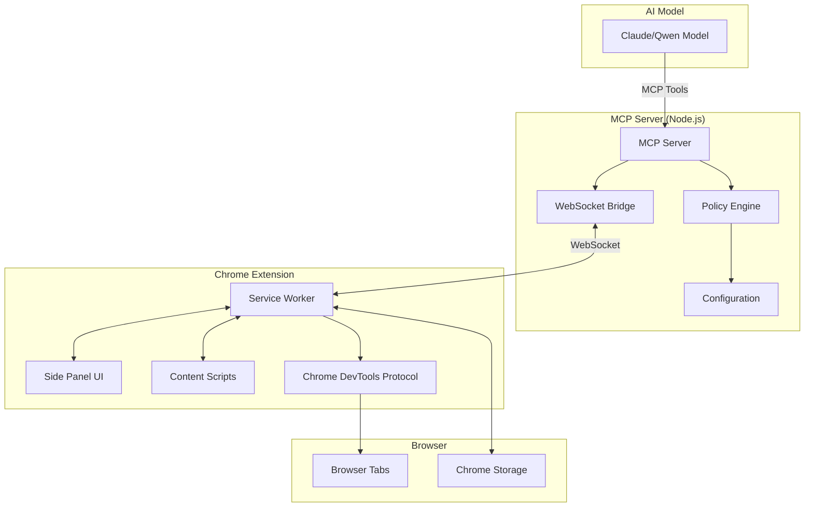
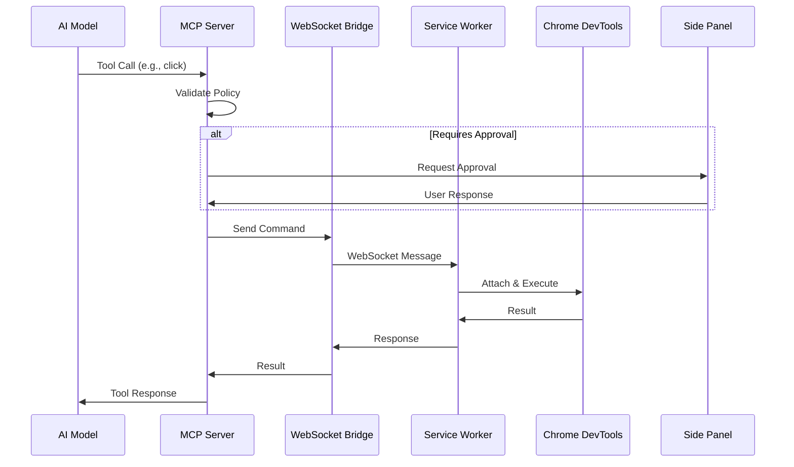

# Design Document

## Overview

The Browser Pilot MCP is a sophisticated browser automation system consisting of a Chrome Manifest V3 extension and a Node.js MCP (Model Context Protocol) server. The system enables AI models to safely control web browsers through a secure, policy-driven architecture that maintains user control while providing comprehensive automation capabilities.

The design follows a three-tier architecture:

1. **AI Model Layer**: Claude/Qwen models communicate via MCP protocol
2. **MCP Server Layer**: Node.js server with policy enforcement and WebSocket bridge
3. **Browser Extension Layer**: Chrome extension with CDP integration and user interface

## Architecture

### System Architecture Diagram



### Communication Flow



## Components and Interfaces

### MCP Server Components

#### Core MCP Server (`mcp-server.ts`)

- **Purpose**: Exposes standardized MCP tools for AI model consumption
- **Key Features**:
  - Tool registration with Zod schema validation
  - Policy enforcement integration
  - Request/response logging
  - Error handling and timeout management

```typescript
interface MCPTool {
  name: string;
  description: string;
  inputSchema: ZodSchema;
  handler: (input: any) => Promise<any>;
}

interface ToolResponse {
  success: boolean;
  data?: any;
  error?: string;
  metadata?: {
    tabId?: number;
    url?: string;
    timestamp: number;
  };
}
```

#### WebSocket Bridge (`bridge.ts`)

- **Purpose**: Manages bidirectional communication with Chrome extension
- **Key Features**:
  - WebSocket server on localhost:8777
  - Connection management and reconnection logic
  - Request/response correlation with UUIDs
  - Message queuing for offline scenarios

```typescript
interface BridgeMessage {
  id: string;
  cmd: string;
  payload: any;
  timestamp: number;
}

interface BridgeResponse {
  replyTo: string;
  payload: any;
  error?: string;
}
```

#### Policy Engine (`policy.ts`)

- **Purpose**: Enforces security policies and user preferences
- **Key Features**:
  - Domain-based allowlist checking
  - Sensitive action detection
  - Step budget tracking
  - Rate limiting and timeout enforcement

```typescript
interface DomainPolicy {
  read: boolean;
  write: boolean;
  requiresApproval?: boolean;
  maxStepsPerHour?: number;
}

interface PolicyDecision {
  allowed: boolean;
  requiresApproval: boolean;
  reason?: string;
  metadata?: any;
}
```

### Chrome Extension Components

#### Service Worker (`service_worker.ts`)

- **Purpose**: Central coordinator for all extension operations
- **Key Features**:
  - WebSocket client connection to MCP server
  - Chrome DevTools Protocol management
  - Tab lifecycle management
  - Message routing between components

```typescript
interface ExtensionCommand {
  cmd: string;
  tabId?: number;
  payload: any;
  requestId: string;
}

interface CDPSession {
  tabId: number;
  attached: boolean;
  lastActivity: number;
  domains: Set<string>;
}
```

#### Side Panel UI (`sidepanel/`)

- **Purpose**: User interface for monitoring and controlling AI actions
- **Key Features**:
  - Real-time action monitoring
  - Approval/denial interface
  - Policy configuration
  - Selector picker tool
  - Activity logging

```typescript
interface UIState {
  connectionStatus: "connected" | "disconnected" | "error";
  currentDomain: string;
  mode: "auto" | "ask" | "readonly";
  pendingApproval?: PendingAction;
  recentActions: ActionLog[];
}

interface PendingAction {
  id: string;
  tool: string;
  args: any;
  domain: string;
  riskLevel: "low" | "medium" | "high";
}
```

#### Content Scripts (`content.ts`)

- **Purpose**: Page-level interactions and selector assistance
- **Key Features**:
  - Element highlighting for selector picker
  - Robust selector generation
  - Page context information
  - Accessibility tree navigation

### Chrome DevTools Protocol Integration

#### CDP Manager

- **Purpose**: Manages Chrome DevTools Protocol sessions
- **Key Features**:
  - Automatic domain enabling (Page, DOM, Runtime, Input)
  - Session lifecycle management
  - Error recovery and reconnection
  - Performance optimization

```typescript
interface CDPManager {
  attachToTab(tabId: number): Promise<void>;
  detachFromTab(tabId: number): Promise<void>;
  sendCommand(tabId: number, method: string, params?: any): Promise<any>;
  isAttached(tabId: number): boolean;
}
```

#### DOM Operations

- **Purpose**: Reliable DOM interaction through CDP
- **Implementation Strategy**:
  - Use `DOM.querySelector` for element location
  - `DOM.getBoxModel` for precise positioning
  - `Input.dispatchMouseEvent` for clicking
  - `Runtime.evaluate` for JavaScript execution

## Data Models

### Configuration Schema

```typescript
interface Configuration {
  allowlist: Record<string, DomainPolicy>;
  sensitivePatterns: string[];
  stepBudget: number;
  toolTimeoutMs: number;
  screenshotDir: string;
  downloadDir: string;
  logging: {
    level: "debug" | "info" | "warn" | "error";
    maxLogSize: number;
    retentionDays: number;
  };
}
```

### Tool Schemas

```typescript
// Navigation Tools
const OpenTabSchema = z.object({
  url: z.string().url(),
});

const NavigateSchema = z.object({
  url: z.string().url().optional(),
  tabId: z.number().optional(),
});

// Interaction Tools
const ClickSchema = z.object({
  selector: z.string(),
  tabId: z.number().optional(),
});

const TypeTextSchema = z.object({
  selector: z.string(),
  text: z.string(),
  submit: z.boolean().optional(),
  tabId: z.number().optional(),
});

// Information Tools
const ReadTextSchema = z.object({
  selector: z.string().optional(),
  tabId: z.number().optional(),
});

const WaitForSchema = z.object({
  selector: z.string(),
  timeout_ms: z.number().optional(),
  tabId: z.number().optional(),
});
```

### Storage Models

```typescript
interface StoredPolicy {
  domain: string;
  policy: DomainPolicy;
  lastUpdated: number;
  userSet: boolean;
}

interface ActionLog {
  id: string;
  timestamp: number;
  tool: string;
  args: any; // Redacted sensitive data
  result: any;
  duration: number;
  tabId?: number;
  url?: string;
  error?: string;
}
```

## Error Handling

### Error Categories and Strategies

#### Network Errors

- **WebSocket Connection Failures**: Exponential backoff reconnection
- **CDP Communication Errors**: Session recreation and retry
- **Tool Timeout Errors**: Graceful cancellation with user notification

#### DOM Interaction Errors

- **Selector Not Found**: Provide alternative selectors and DOM inspection
- **Element Not Interactable**: Wait for element state changes
- **Navigation Failures**: Retry with different strategies

#### Policy Violations

- **Domain Restrictions**: Clear error messages with allowlist suggestions
- **Sensitive Action Blocks**: User approval prompts with context
- **Rate Limit Exceeded**: Temporary blocking with retry timing

### Error Response Format

```typescript
interface ErrorResponse {
  success: false;
  error: {
    code: string;
    message: string;
    details?: any;
    suggestions?: string[];
    retryable: boolean;
  };
  metadata: {
    tool: string;
    timestamp: number;
    tabId?: number;
    url?: string;
  };
}
```

## Testing Strategy

### Unit Testing

- **MCP Server**: Tool validation, policy enforcement, bridge communication
- **Extension Components**: Message handling, CDP operations, UI interactions
- **Utilities**: Selector generation, data redaction, configuration parsing

### Integration Testing

- **End-to-End Tool Flows**: Complete MCP → Extension → Browser cycles
- **Policy Enforcement**: Domain restrictions, approval workflows
- **Error Recovery**: Connection failures, tab closures, timeout scenarios

### Acceptance Testing Framework

- **Automated Browser Tests**: Puppeteer-based test scenarios
- **Policy Validation**: Security boundary testing
- **Performance Testing**: Load testing with multiple concurrent operations

### Test Data Management

- **Mock Websites**: Local test pages with various interaction patterns
- **Configuration Fixtures**: Predefined policy sets for testing
- **Selector Test Cases**: Robust selector generation validation

## Security Considerations

### Data Protection

- **Sensitive Data Redaction**: Automatic filtering of passwords, payment info
- **Logging Sanitization**: Remove PII from all log outputs
- **Storage Encryption**: Chrome storage with appropriate security levels

### Access Control

- **Domain Allowlisting**: Granular read/write permissions per domain
- **User Approval Gates**: Required confirmation for sensitive actions
- **Session Management**: Automatic cleanup of CDP sessions

### Attack Surface Mitigation

- **Input Validation**: Comprehensive Zod schema validation
- **Sandboxed Execution**: Limited JavaScript execution contexts
- **Network Isolation**: Local-only WebSocket communication

## Performance Optimization

### Resource Management

- **CDP Session Pooling**: Reuse sessions across multiple operations
- **Memory Management**: Automatic cleanup of inactive sessions
- **Network Efficiency**: Message batching and compression

### Caching Strategies

- **DOM State Caching**: Cache element locations for repeated operations
- **Policy Caching**: In-memory policy storage with TTL
- **Screenshot Optimization**: Incremental capture and compression

### Monitoring and Metrics

- **Performance Tracking**: Operation timing and success rates
- **Resource Usage**: Memory and CPU monitoring
- **Error Analytics**: Failure pattern analysis and alerting

## Deployment and Configuration

### Development Environment

- **Hot Reload**: Automatic extension reloading during development
- **Debug Logging**: Comprehensive logging for troubleshooting
- **Test Automation**: Continuous integration with browser testing

### Production Configuration

- **Policy Templates**: Pre-configured security policies for common use cases
- **Update Mechanism**: Safe configuration updates without service interruption
- **Backup and Recovery**: Configuration and log backup strategies

### Monitoring and Observability

- **Health Checks**: System component status monitoring
- **Performance Metrics**: Response time and throughput tracking
- **Error Reporting**: Structured error logging and alerting
